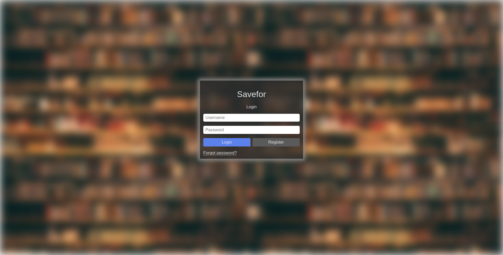
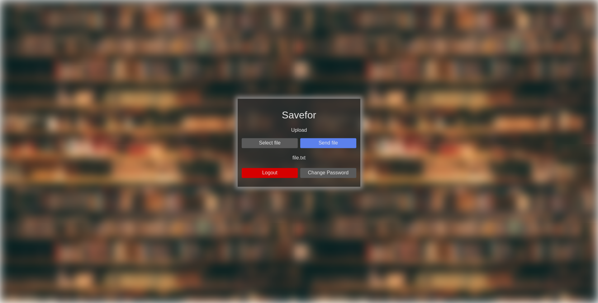
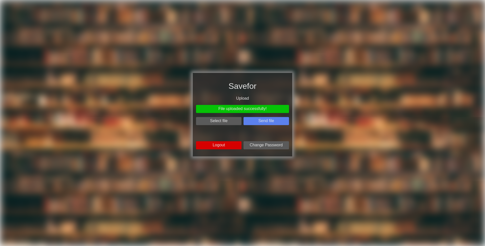
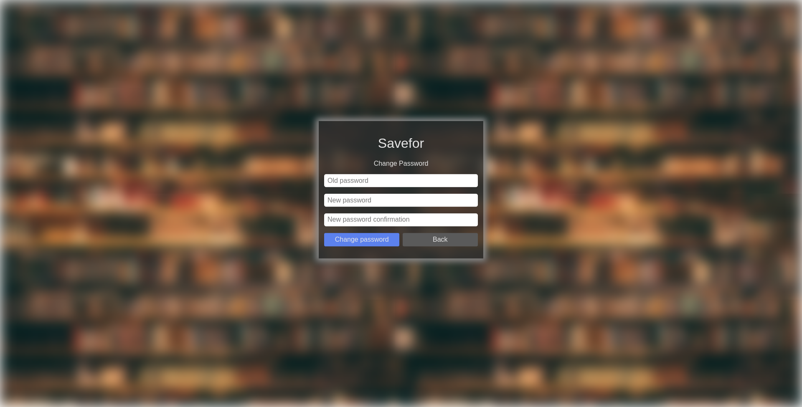

# Savefor - Web

Savefor is a web app to receive files uploaded either by itself or <a href="https://github.com/gilsongindrejr/savefor-desktop">savefor desktop app</a>.

# Table of Contents
1. [About the project](#about-the-project)
    - [Features](#features)
    - [Build With](#build-with)
2. [Getting started](#getting-started)
3. [Usage](#usage)

## About the project

This project started as a code interview and became a personal project for learning Django.
### features

- Upload files to a django server using the web app itself
- Receive files uploaded by <a href="https://github.com/gilsongindrejr/savefor-desktop">savefor desktop app</a>.
### Build with
- [Python 3](https://www.python.org) - A high level programming language
- [Django](https://www.djangoproject.com) - Web framework

## Getting started
### Create a virtual enviroment
```
python -m venv venv
```

### Activate the enviroment

Windows (Powershell)
```
.\venv\Scripts\Activate.ps1
```

Linux
```
source venv/bin/activate
```

### Install the dependencies
```
pip install -r requirements.txt
```

### Create the migrations
```
python manage.py makemigrations
```

```
python manage.py migrate
```

### Start the server
```
python manage.py runserver
```

The app will be available at: [127.0.0.1:8000/users/login](http://127.0.0.1:8000/users/login).


## Usage
### Create an account

Access: [127.0.0.1:8000/users/register](http://127.0.0.1:8000/users/register) and fill the required fields.


### Login

Access: [127.0.0.1:8000/users/login](http://127.0.0.1:8000/users/login) and type your username and password.



### Upload the files

When logged in, access: [127.0.0.1:8000/upload](http://127.0.0.1:8000/upload) select a file in ```Select file``` button and click ```Send file```, you will receive a success message.




### Change password

When logged in, access: [127.0.0.1:8000/users/password_change](http://127.0.0.1:8000/users/password_change) and type the old password, the new password and confirm the new password.



